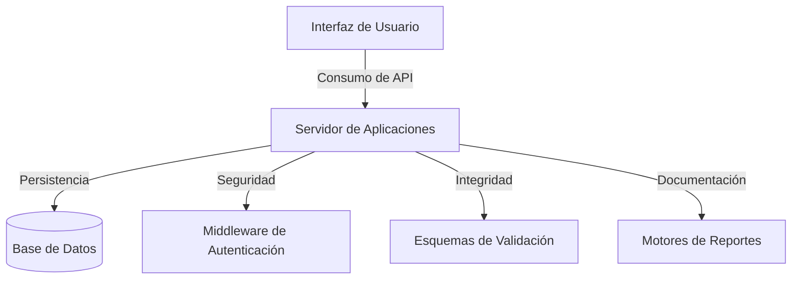

# MV Inventario Pro

MV Inventario Pro representa la culminación de un proceso de desarrollo enfocado en transformar la gestión operativa de las tiendas de moda. Lo que inició como una herramienta técnica para el control de existencias ha madurado hasta convertirse en una solución integral que entiende y resuelve las necesidades reales de un negocio en crecimiento.

---

## La Evolución del Sistema
Este proyecto nació de la necesidad de simplificar procesos. En su versión actual, el sistema ha trascendido sus funciones básicas para ofrecer una experiencia completa:

- **Modulo de Facturación:** Diseñado para agilizar el punto de venta, permitiendo la emisión de recibos y el manejo automatizado de impuestos con una precisión contable.
- **Centro de Configuración Avanzado:** Un panel administrativo robusto que otorga al usuario el control total sobre los parámetros operativos, la seguridad y las políticas de impuestos.
- **Análisis y Estrategia:** Implementación de gráficas dinámicas que no solo muestran datos, sino que cuentan la historia del rendimiento del inventario para facilitar la toma de decisiones.
- **Experiencia de Usuario Unificada:** Una interfaz moderna, limpia y adaptable que incluye un modo oscuro nativo, pensada para reducir la carga visual durante jornadas extensas de trabajo.

---

## Tecnologías y Fundamentos

| Capa | Definición Técnica |
|----------|---------|
| **Backend** | Node.js (v18+), framework Express y persistencia en MySQL 8.0 bajo entornos Docker. |
| **Frontend** | Estructura semántica en HTML5, estilos avanzados en CSS3, lógica pura en JavaScript y utilidades de Tailwind CSS. |
| **Integraciones** | Visualización de datos con Chart.js y generadores de documentos con ExcelJS y PDFKit. |
| **Seguridad** | Protocolos de autenticación JWT y algoritmos de encriptación Bcrypt para la protección de datos sensibles. |

---

## Arquitectura del Ecosistema



---

## Guía de Implementación

### Despliegue con Docker
Para asegurar la consistencia del entorno y facilitar la puesta en marcha, se recomienda el uso de contenedores:

```bash
# Clone el repositorio e ingrese al directorio del proyecto
git clone <repository-url>
cd mv-inventario

# Levante los servicios definidos en la orquestación
docker-compose up -d --build

# Configure las credenciales iniciales de seguridad
node set-password.mjs
```

### Acceso Inicial
Una vez finalizada la configuración, puede ingresar al sistema con las siguientes credenciales predeterminadas:
- **Correo Electrónico:** admin@mv.com
- **Contraseña:** admin123

---

## Capacidades Operativas

### Punto de Venta y Facturación
El sistema permite una búsqueda fluida de artículos por diversos criterios, gestionando un carrito de compras interactivo que culmina en la generación de comprobantes profesionales y el ajuste automático del inventario.

### Análisis y Reportes
Ofrece una visión clara de la salud del negocio, desde el seguimiento de productos con baja rotación hasta la exportación de libros de movimientos en formatos universales como Excel y PDF.

### Administración y Control
Incluye herramientas para el respaldo de información, gestión de perfiles de usuario y personalización de alertas críticas para evitar quiebres de stock.

---

## Operaciones del Sistema

| Acción Requerida | Comando de Ejecución |
|----------|---------|
| Iniciar Servicios | docker-compose up -d |
| Monitoreo de Eventos | docker logs mv-inventario-api |
| Reinicio de Base de Datos | docker-compose restart db |
| Sincronización Completa | docker-compose up -d --build |
| Acceso Administrativo SQL | docker exec -it inventario-db mysql -u root -p |

---

## Integridad y Seguridad
El desarrollo se rige por estándares de seguridad que incluyen la prevención de inyecciones SQL mediante consultas preparadas, validación estricta de datos entrantes y una arquitectura aislada que garantiza la estabilidad y confiabilidad de la información del negocio.

---

## Versatilidad de Visualización
El sistema ha sido optimizado para ofrecer una experiencia consistente en múltiples dispositivos, desde monitores de alta resolución hasta terminales móviles y lectores periféricos.

---

## Autoría y Desarrollo

### **Fabián Enrique Pilonieta Pilonieta**
*Desarrollador Full Stack y Arquitecto del Sistema*

Como responsable único del proyecto, he liderado cada etapa de su ciclo de vida, desde la ingeniería del lado del servidor y el diseño de la base de datos, hasta la creación de una interfaz intuitiva y la implementación de las capas de seguridad y despliegue. Este sistema es el resultado de un compromiso con la calidad técnica y la funcionalidad práctica.

---

**Institución:** SENA (Servicio Nacional de Aprendizaje)  
**Año:** 2026  
**Licencia:** [MIT](LICENSE)
